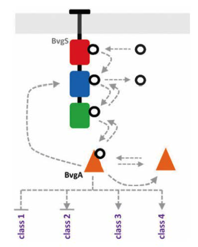

# Mathematical Model of Infection Mechanism of Bordetella

## Introduction
In this work, the infection strategy of Bordetella has been modelled. Four classes of genes, called virulence factors, need to perform specific dynamic response in Bordetella to infect its host. These genes are the products of a two-component signal transduction system known as BvgAS. The proteins that are modelled in this papers are namely, BvgA, BvgS, class 1, class 2, class 3 and class 4. BvgA can exist in three possible states which depends on the phosphorylation of specific domain of protein, these states are namely BvgA-P1, BvgA-P2, BvgA-P3. Also BvgA protein can also state exist in two active and inactive states. Active BvgA is responsible for auto-transcription and transcription of class1 to class 4 genes. We used stochastic simulation to solve the 20 model equations as given in the paper. Gillespie algorithm will be used to solve the system of equations. In Gillespie algorithm we define the probability of each reaction happening and then this probability will decide which reaction will happen more frequently. We assume that at any instance only one reaction will be occurring (proportional to its probability). The number of molecules of certain species will then be changed according to these defined probabilities. We reproduced all the different results given in the paper by reproducing the dynamic plots of class 1-class 4 gene expressions.

